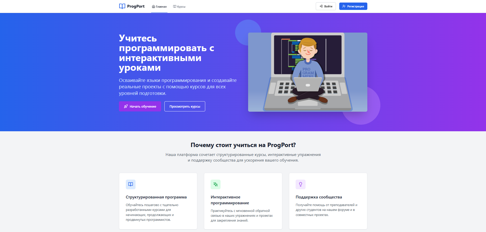
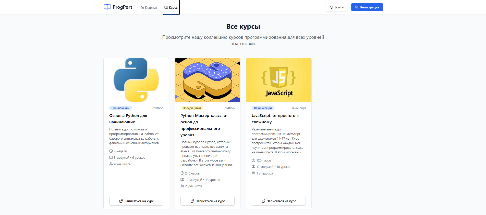
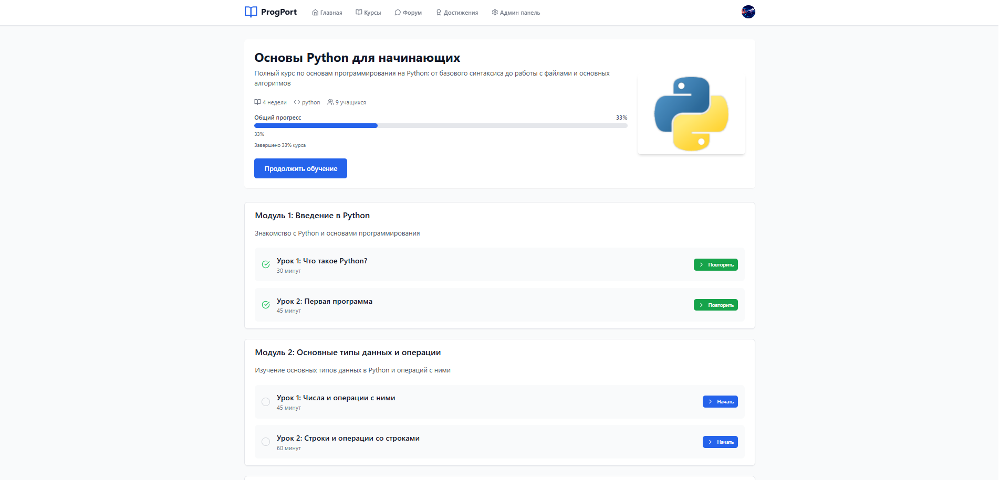
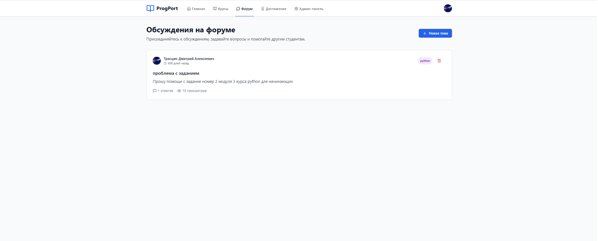
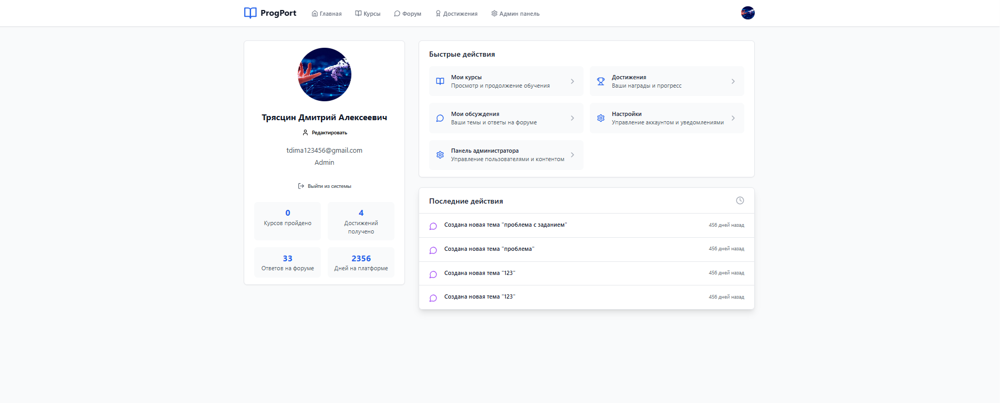

# ProgPort

> Full-stack образовательная платформа для изучения программирования через курсы, практические задания, обсуждения и отслеживание прогресса.

ProgPort — веб-приложение для школьников, которые изучают программирование. Платформа объединяет интерактивные учебные материалы, упражнения, форум, достижения и отдельные рабочие пространства для учеников, преподавателей и администраторов.

Проект демонстрирует разработку полноценного React-приложения, связанного с Express API, MongoDB, системой аутентификации, загрузкой файлов, email-сценариями, модерацией и разграничением доступа по ролям.

## Почему проект интересен

- **Обучение:** курсы разделены на модули и уроки, есть отслеживание прогресса и отправка решений.
- **Сообщество:** пользователи могут создавать темы, писать комментарии, редактировать свои сообщения и отмечать принятые ответы.
- **Геймификация:** достижения и история активности мотивируют регулярно заниматься.
- **Разграничение доступа:** ученики, преподаватели и администраторы получают разные возможности и панели управления.
- **Практический backend:** JWT-аутентификация, хеширование паролей, ограничение частоты запросов, подтверждение email, восстановление пароля и защищённые API-маршруты.
- **Управление контентом:** преподаватели и администраторы могут работать с курсами, а администраторы — с пользователями и статистикой.

## Скриншоты интерфейса

### Главная страница



### Каталог курсов



### Страница урока



### Форум



### Личный кабинет



## Основные возможности

### Для учеников

- Просмотр каталога курсов по программированию.
- Запись на курсы и продолжение обучения с сохранённым прогрессом.
- Чтение уроков в Markdown и отправка решений упражнений.
- Просмотр достижений и последней активности.
- Участие в форуме и получение помощи от сообщества.
- Управление профилем, аватаром, email и паролем.

### Для преподавателей

- Управление собственными курсами.
- Просмотр учеников и их прогресса.
- Работа с содержанием курсов и упражнениями.

### Для администраторов

- Управление пользователями и ролями.
- Управление каталогом курсов.
- Просмотр административной статистики.
- Модерация тем и комментариев форума.

### Аутентификация и сервисы платформы

- Регистрация и вход на основе JWT.
- Подтверждение email и повторная отправка письма.
- Восстановление пароля с помощью кодов.
- Подтверждение смены email.
- Защищённые маршруты на frontend и backend.
- Загрузка пользовательских аватаров.
- Ограничение частоты запросов и ролевая авторизация.
- Интеграция автоматической модерации контента с Yandex Cloud.

## Технологический стек

### Frontend

- React
- TypeScript
- Vite
- React Router
- Axios
- Tailwind CSS
- React Markdown
- Monaco Editor React
- Lucide React
- React Hot Toast

### Backend

- Node.js
- Express
- MongoDB и Mongoose
- JSON Web Tokens
- bcryptjs
- Multer
- Nodemailer
- CORS и Express Rate Limit
- node-cron

## Архитектура

Проект использует full-stack структуру в одном репозитории:

```text
src/                  React + TypeScript frontend
  components/         Переиспользуемые UI-компоненты и access control
  contexts/           Аутентификация и состояние приложения
  pages/              Страницы ученика, преподавателя и администратора
  api/                Конфигурация Axios
server/               Express backend
  controllers/        Обработчики запросов
  middleware/         Аутентификация, роли и rate limiting
  models/             Mongoose-модели данных
  routes/             Модули REST API
  services/           Email- и moderation-сервисы
  utils/              Общие backend-утилиты
```

Frontend реализован как SPA на React Router. Backend предоставляет REST API под префиксом `/api`, использует Mongoose для работы с MongoDB и отдаёт загруженные файлы из директории `uploads`.

## Основные маршруты

| Раздел | Маршруты |
|---|---|
| Публичные | `/`, `/courses`, `/forum`, `/login`, `/register`, `/forgot-password` |
| Ученик | `/my-courses`, `/my-forum-topics`, `/achievements`, `/profile`, `/settings` |
| Обучение | `/courses/:courseId`, `/courses/:courseId/modules/:moduleId/lessons/:lessonId` |
| Преподаватель | `/teacher/students`, `/teacher/courses` |
| Администратор | `/admin/users`, `/admin/courses`, `/admin/stats` |

## Установка и запуск

### Требования

- Node.js 
- npm
- Локальный или удалённый экземпляр MongoDB
- SMTP-данные для email-сценариев, если эти функции используются

### Установка зависимостей

```bash
npm install
```

Создай env-файлы для frontend и backend. Не добавляй реальные учетные данные в репозиторий.

Основные переменные backend:

```env
PORT=5000
MONGO_URI=your_mongodb_connection_string
JWT_SECRET=your_jwt_secret
MAIL_USER=your_mail_user
MAIL_PASS=your_mail_password
YANDEX_API_KEY=your_yandex_api_key
YANDEX_FOLDER_ID=your_yandex_folder_id
NODE_ENV=development
```

Для frontend при необходимости укажи базовый URL API:

```env
VITE_API_URL=http://localhost:5000/api
```

### Запуск приложения

Запусти backend:

```bash
npm run server
```

В отдельном терминале запусти frontend:

```bash
npm run dev
```

Или запусти оба сервиса одной командой:

```bash
npm run dev:all
```

Обычно Vite запускается на `http://localhost:5173`, а API — на `http://localhost:5000`.

### Заполнение демо-курсов

```bash
npm run seed:courses
```

### Production-сборка

```bash
npm run build
npm run preview
```

### Проверка линтером

```bash
npm run lint
```

## Модули API

Backend организован через отдельные REST-модули:

- `/api/auth` — регистрация, вход, подтверждение email, восстановление пароля и управление ролями.
- `/api/courses` — каталог курсов, запись на курс, уроки, модули и отправка решений.
- `/api/forum` — темы, публикации, комментарии, принятые ответы и модерация.
- `/api/achievements` — достижения и прогресс по ним.
- `/api/users` — профиль, аватар, статистика, активность и данные об учениках.
- `/api/exercises` — упражнения, завершение уроков и прогресс обучения.

## Статус проекта

Проект оформлен как полноценное full-stack приложение для портфолио. В репозитории есть команды разработки и production-сборки, но отдельный автоматизированный набор тестов и конфигурация деплоя пока не добавлены.

## Описание для резюме

**ProgPort — full-stack образовательная платформа для изучения программирования.** Разработан SPA на React и TypeScript с каталогом курсов, записью на обучение, уроками и упражнениями, форумом, достижениями, ролевыми интерфейсами ученика, преподавателя и администратора, а также настройками аккаунта. Создан backend на Express и MongoDB с JWT-аутентификацией, хешированием паролей, подтверждением email, восстановлением доступа, загрузкой файлов, rate limiting, интеграцией модерации и REST API.

## Лицензия

Проект предназначен для учебных и портфолио-целей. 
